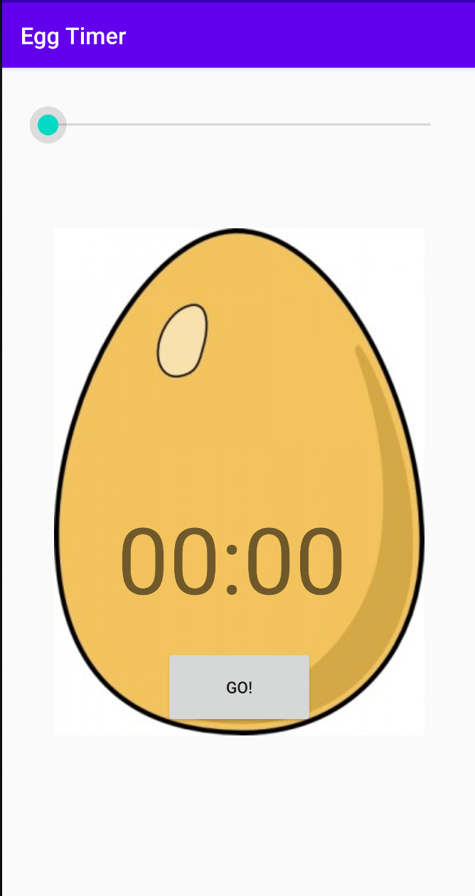
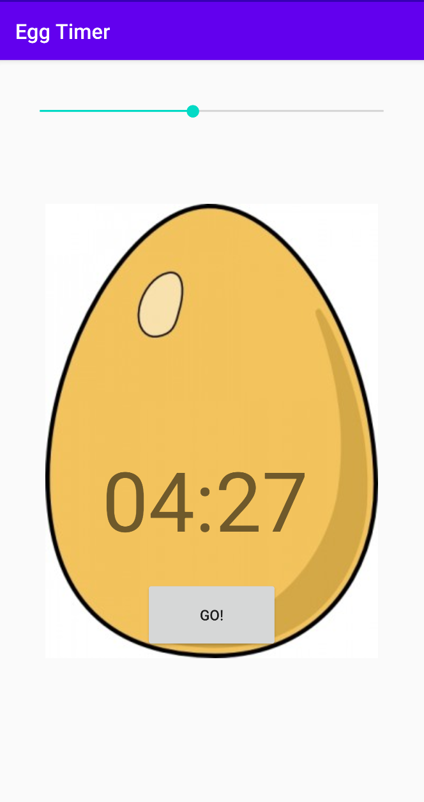
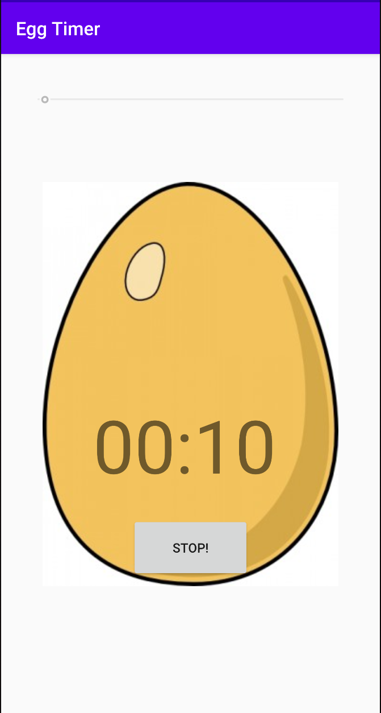

# Egg-Timer
An Android application that allows the user to set timers. 

## Default Screen

## Adjusting the duration of the timer with the help of the scroll bar.

## Starting the timer by clicking on the start button.

